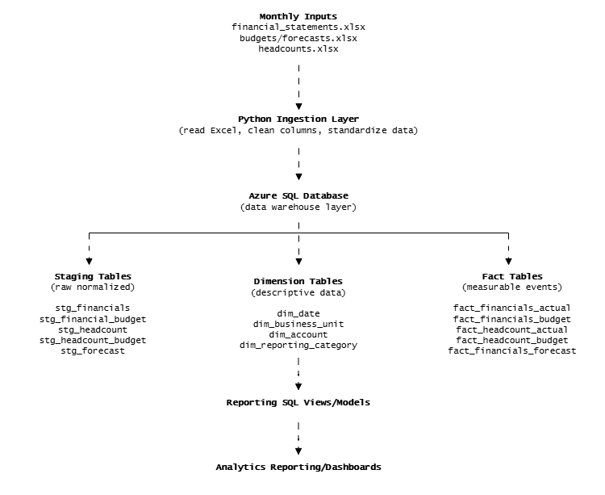
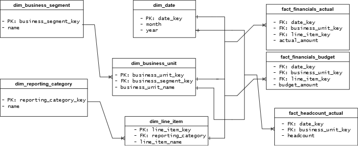

# Financial Data Warehouse

## Overview
This project implements a financial analytics data warehouse designed to support reporting and performance analysis across business units.  
The warehouse integrates financial statements, budget forecasts, and headcount data using a layered data pipeline built with Python and Azure SQL.

Data is ingested from Excel-based financial reports, transformed into standardized staging tables, and modeled into fact and dimension tables for analytics and dashboarding.

## Warehouse Architecture
The system follows a layered data warehouse architecture to separate ingestion, transformation, and analytics workloads.

## Data Pipeline
Financial data is updated monthly through an automated ingestion pipeline.

Excel → Python → Azure SQL → SQL transformations → Power BI

## Data Warehouse Schema

## Data Privacy 
All data structures and code examples are simplified versions of internal systems.  
Table names and fields have been generalized to protect confidential information.
