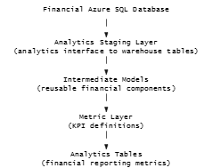

# Financial Metrics Modeling Framework

## Overview
###### This project demonstrates how to design maintainable SQL models for financial KPI reporting. 
###### The project focuses on structuring financial metrics logic into reusable transformation layers to support scalable analytics workflows.

## Engineering Goals
###### The objective of this project is to design a transformation framework that:
###### - separates business logic from warehouse storage tables
###### - improves SQL maintainability
###### - standardizes KPI calculations
###### - enables reusable financial metric definitions
###### - supports future metric expansion without rewriting large queries

## Data Source
###### The data used in this project originates from the warehouse tables created in the Financial Data Warehouse project.

## Transformation Architecture


### Analytics Staging Layer
###### This layer focuses on:
###### - aligning warehouse tables with analytics naming conventions
###### - exposing consistent reporting grains
###### - isolating analytics logic from warehouse schema changes

### Intermediate Models
###### Intermediate models isolate reusable financial logic used by multiple KPI calculations.
###### Examples include:
###### - revenue component aggregation
###### - expense category grouping
###### - prior year comparisons
###### - budget variance preparation

###### SQL query Example Snippet 1:
```
WITH current_period AS (
    SELECT
        f.month_year,
        f.business_unit,
        SUM(CASE WHEN f.metric_code = 'REVENUE' THEN f.amount_ytd END) AS net_revenue,
        SUM(CASE WHEN f.metric_code = 'EBITDA' THEN f.amount_ytd END) AS ebitda,
        SUM(CASE WHEN f.metric_code = 'GNA_TOTAL' THEN f.amount_ytd END) AS total_gna,
        SUM(CASE WHEN f.metric_code IN ('PERSONNEL', 'BONUS') THEN f.amount_ytd END) AS personnel_cost
    FROM fact_financials f
    GROUP BY
        f.month_year,
        f.business_unit
),
prior_year AS (
    SELECT
        DATEADD(YEAR, 1, prior.month_year) AS month_year,
        prior.business_unit,
        SUM(CASE WHEN prior.metric_code = 'REVENUE' THEN prior.amount_ytd END) AS prior_year_revenue,
        SUM(CASE WHEN prior.metric_code = 'EBITDA' THEN prior.amount_ytd END) AS prior_year_ebitda
    FROM fact_financials prior
    GROUP BY
        prior.month_year,
        prior.business_unit
)
SELECT
    c.month_year,
    c.business_unit,
    c.net_revenue,
    c.ebitda,
    c.total_gna,
    c.personnel_cost,
    p.prior_year_revenue,
    p.prior_year_ebitda
FROM current_period c
LEFT JOIN prior_year p
    ON c.month_year = p.month_year
   AND c.business_unit = p.business_unit
```

### Metric Layer
###### The metric layer defines standardized business KPIs used in financial reporting.
###### Examples of calculated metrics:
###### - Net Revenue/EBITDA/Personnel Expenses/G&A Expenses Per Employee/Department Manager
###### - Budget vs Actual Variance
###### - Prior Year Comparison Metrics

###### SQL query Example Snippet 2:
```
WITH kpi_base AS (
    SELECT
        month_year,
        business_unit,
        net_revenue,
        ebitda,
        personnel_cost,
        total_gna,
        prior_year_revenue,
        prior_year_ebitda,
        headcount
    FROM metric_prep
),

kpi_metrics AS (
    SELECT
        month_year,
        business_unit,
        CAST(net_revenue / NULLIF(headcount, 0) AS FLOAT) AS revenue_per_employee,
        CAST(ebitda / NULLIF(net_revenue, 0) AS FLOAT) AS ebitda_margin,
        CAST(personnel_cost / NULLIF(total_gna, 0) AS FLOAT) AS personnel_share_of_gna,
        CAST((net_revenue - prior_year_revenue) / NULLIF(prior_year_revenue, 0) AS FLOAT) AS revenue_yoy_pct,
        CAST((ebitda - prior_year_ebitda) / NULLIF(prior_year_ebitda, 0) AS FLOAT) AS ebitda_yoy_pct
    FROM kpi_base
)

SELECT *
FROM kpi_metrics
```

###### SQL query Example Snippet 3
```
SELECT
    month_year,
    business_unit,
    metric_name,
    metric_value
FROM final_kpis
UNPIVOT (
    metric_value FOR metric_name IN (
        revenue_per_employee,
        ebitda_margin,
        revenue_yoy_pct,
        personnel_share_of_gna
    )
) AS unpvt
```
### Data Quality Validation
###### Data validation queries are included to ensure data consistency before KPI calculations are produced.
###### Example checks include:
###### - duplicate financial records
###### - missing key dimensions
###### - unexpected null values

### Example KPI Output
###### Business names and sensitive identifiers have been anonymized while preserving the table structure.
###### Schema
```
reporting_period | DATE
business_unit    | VARCHAR
metric_name      | VARCHAR
metric_value     | FLOAT
```
###### Example Output

| reporting_period | business_unit | metric_name | metric_value |
|---|---|---|---|
| 2024-01 | Unit_A | Revenue_per_Employee_Monthly | 25015.12 |
| 2024-01 | Unit_A | Revenue_per_Employee_Annual | 363458.66 |
| 2024-01 | Unit_A | Profit_per_Employee_Monthly | 2827.20 |

###### Example Output Json
```
[
  {
    "reporting_period": "2024-01-01",
    "business_unit": "Unit_A",
    "metric_name": "Revenue_per_Employee_Monthly",
    "metric_value": 25015.12
  },
  {
    "reporting_period": "2024-01-01",
    "business_unit": "Unit_A",
    "metric_name": "Revenue_per_Employee_Annual",
    "metric_value": 363458.66
  },
  {
    "reporting_period": "2024-01-01",
    "business_unit": "Unit_A",
    "metric_name": "Profit_per_Employee_Monthly",
    "metric_value": 2827.20
  }
]
```

