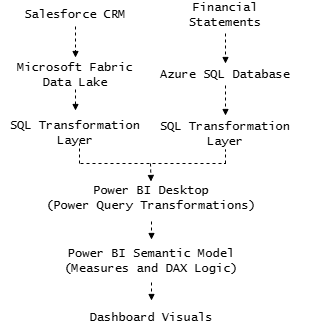
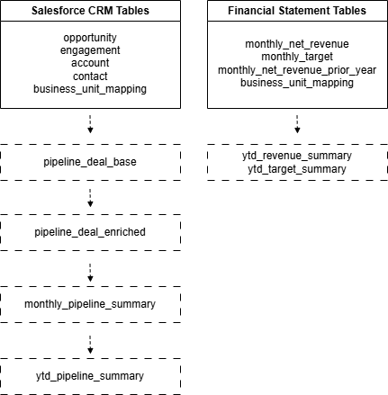
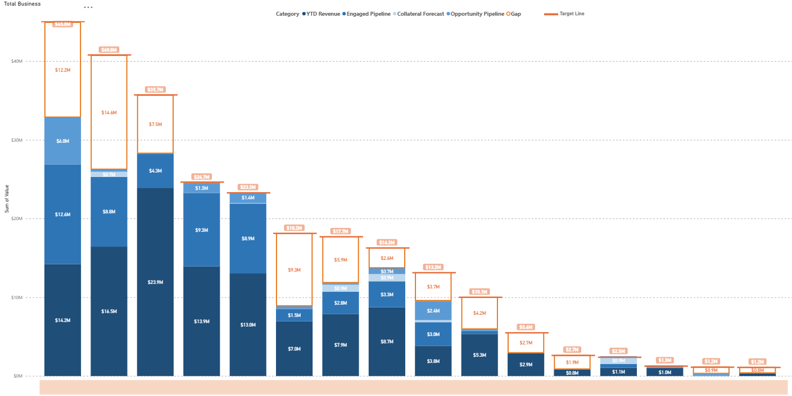

## Revenue-to-Target Gap Analytics Pipeline

### Overview

###### This project builds....

### Architecture

### SQL Data Preparation
###### This SQL Layer standardized and transformed CRM and financial data into reusable reporting datasets for Power BI transformation and dashboarding

#### Stages Explanation
###### **1. Source extraction and standardization**
######  - extracted active pipeline records
######  - standardized date and deal stage fields
######  - filtered non-reportable records

###### **2. Enrichment and mapping**
######  - joined deals to business-unit mappings
######  - categorized deals conditionally into business pipelines
######  - created a unified pipeline deal dataset

###### **3. Aggregation for reporting**
######  - summarized data by month, pipeline category, and business unit
######  - prepared YTD-ready reporting outputs

####  Representative SQL Examples
######  Example 1
######  Example 2
######  Example 3

### Power Query Transformations
###### Additional transformations were performed using Power Query(M). This layer reshaped the SQL outputs into a reporting-ready dataset used in the Power BI semantic model.
###### Key responsibilities of this layer included: 
######  - integrating multiple datasets (financial actuals, pipeline data, and budget targets)
######  - standardizing business-unit labels using mapping tables
######  - creating grouped reporting categories
######  - reshaping data using pivot and unpivot operations
######  - appending datasets across multiple reporting periods
######  - preparing the final dataset used for gap analysis

### Power BI Semantic Model
###### The processed dataset was loaded into the Power BI semantic model, where additional calculations and measures were defined.
###### This model supports:
###### - revenue vs target comparison
###### - gap analysis over time
###### - category-level performance analysis

### Dashboard Visuals 
##### Example visualization from the Revenue-to-Target Gap Analysis dashboard.

##### Stacked bars show actual revenue and pipeline contribution by business unit compared against the annual target, highlighting the remaining gap

